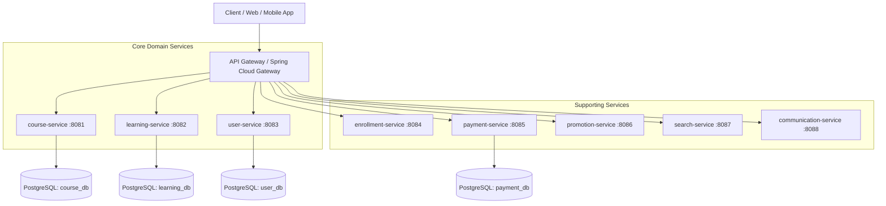

# 🎓 CourseHub - Enterprise Microservices E-Learning Platform Backend

[](https://www.oracle.com/java/)
[](https://spring.io/projects/spring-boot)
[](#architecture-overview)
[](https://mybatis.org/mybatis-3/)
[](LICENSE)

**CourseHub Backend** là một hệ thống Backend kiến trúc **Microservices** hiện đại dành cho nền tảng giáo dục trực tuyến. Hệ thống được thiết kế theo các nguyên lý kiến trúc phần mềm chuẩn doanh nghiệp: **Domain-Driven Design (DDD)**, **Clean / Hexagonal Architecture (Ports and Adapters)**, tuân thủ nghiêm ngặt nguyên tắc **SOLID** và tính toàn vẹn giao dịch dữ liệu **ACID**.

---

## 🏛️ System Architecture Overview

Hệ thống bao gồm **8 Microservices** độc lập, mỗi service quản lý một Domain Bounded Context riêng biệt:



---

## 🚀 Key Features & Highlights

### 1. Hexagonal / Clean Architecture (Ports & Adapters)
Mỗi service (ví dụ: `course-service`) tuân thủ nghiêm ngặt nguyên tắc phân tầng 4 lớp:
- **`domain`**: Chứa Business Aggregates (`Course`, `Category`), Value Objects (`Money`, `Slug`), Domain Enums và Domain Repository Interfaces. Hoàn toàn độc lập với Spring Boot, MyBatis hay Database.
- **`application`**: Chứa các Use Case Handlers và Commands (`CreateCourseCommand`, `PublishCourseUseCase`), điều phối luôn các luồng nghiệp vụ.
- **`api`**: REST Controllers, DTO Requests/Responses và Global Exception Handlers.
- **`infrastructure`**: Chứa MyBatis Mappers, Infrastructure Entities (`*InfraEntity`), Database Configurations và Repository Adapters (`CourseRepositoryAdapter`).

### 2. Custom Persistence Strategy (MyBatis + Custom TypeHandlers)
- Sử dụng **MyBatis** thay vì ORM mặc định để kiểm soát 100% câu lệnh SQL, tối ưu hóa các câu truy vấn phức tạp và tránh lỗi N+1.
- Triển khai **`UuidTypeHandler`** riêng biệt để xử lý kiểu dữ liệu `UUID` gốc của PostgreSQL.
- Quản lý phiên bản Schema tập trung và tự động bằng **Flyway Migration**.

### 3. Strict SOLID & ACID Compliance
- **SRP:** Tách biệt tuyệt đối trách nhiệm giữa Domain Rules, Business Use Cases, REST DTOs và Persistence Entities.
- **DIP:** Domain không phụ thuộc vào Infrastructure. Repository Adapters triển khai lại các Interface định nghĩa ở Domain Layer.
- **Atomicity & Consistency:** Quản lý Transaction đa bảng bằng `@Transactional` kết hợp với các Check Constraints, Foreign Keys `ON DELETE CASCADE` và Unique Indexes ở cấp độ PostgreSQL DB.

---

## 🛠️ Technology Stack

| Layer / Aspect | Technologies Used |
| :--- | :--- |
| **Language & Runtime** | Java 21 LTS |
| **Framework** | Spring Boot 3.x, Spring Web |
| **Persistence / Data Access** | MyBatis 3.x, PostgreSQL 16, Flyway Migration |
| **Architecture Patterns** | Domain-Driven Design (DDD), Clean Architecture, Ports & Adapters, CQRS (Command-Query Segregation) |
| **DevOps & Containerization** | Docker, Docker Compose, Maven Multi-Module |
| **Code Generation & Tools** | Lombok, MapStruct (Option), JUnit 5 |

---

## 📁 Repository Structure

```text
coursehub-backend/
├── docker-compose.yml          # Container orchestration cho tất cả các DB & Services
├── pom.xml                     # Parent POM quản lý dependencies
├── structure.md                # Quy chuẩn kiến trúc & phân tầng mã nguồn
└── services/
    ├── course-service/         # Quản lý Khóa học, Module, Bài học, Asset, Category
    ├── user-service/           # Quản lý Người dùng, Auth, Profile, Instructor
    ├── enrollment-service/     # Quản lý Ghi danh khóa học & Tiến độ
    ├── learning-service/       # Quản lý Trải nghiệm học tập & Video Streaming
    ├── payment-service/        # Quản lý Giao dịch & Cổng thanh toán
    ├── promotion-service/      # Quản lý Mã giảm giá & Chiến dịch khuyến mãi
    ├── search-service/         # Tìm kiếm nâng cao & Indexing
    └── communication-service/ # Gửi Email, Thông báo (Notification)
```

---

## ⚡ Quick Start & Local Setup

### Yêu cầu môi trường (Prerequisites)
- **Java 21** trở lên
- **Maven 3.8+**
- **Docker** & **Docker Compose**

### 1. Khởi chạy Database Container
```bash
docker-compose up -d postgres
```

### 2. Build Dự án
```bash
# Build tất cả các microservices từ root
mvn clean package -DskipTests
```

### 3. Chạy `course-service`
```bash
cd services/course-service
./mvnw spring-boot:run
```

---

## 🧪 Testing & Code Quality Verification

Để đảm bảo quy chuẩn kiến trúc và MyBatis Mappings không bị phá vỡ:

```powershell
# Chạy Unit Tests cho course-service
cd services/course-service
.\mvnw.cmd test
```

---

## 📜 License
Dự án được phân phối dưới giấy phép [MIT License](LICENSE).
